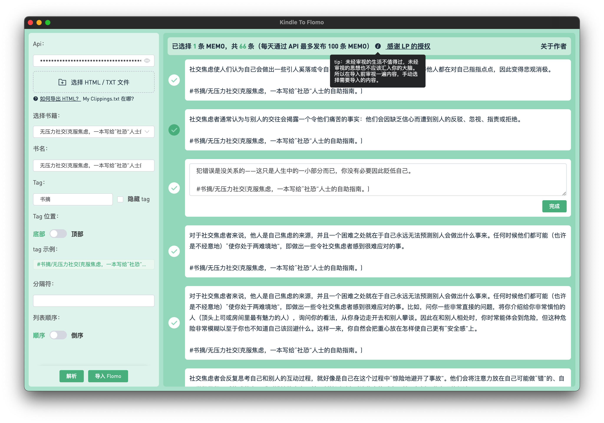

# Kindle2Flomo

> 本软件已获得 lupeng 授权感谢 [lupeng](https://github.com/pengloo53/kindle2flomo) 的授权

将 Kindle 笔记一键导入至 flomo

## 注册 [flomo](https://flomoapp.com/register2/?MTAzNDE)

## 在线访问地址：[Kindle2Flomo](https://tit1e.github.io/kindle2Flomo/)

## Mac 应用下载
* [蓝奏云](https://wwr.lanzoui.com/b02c3nkyf) 密码:47if
* [releases](https://github.com/Tit1e/kindle2Flomo/releases)

## 问题反馈

## 预览

## 开发注意事项
**bplistParser** 这个依赖需手动修改 `maxObjectSize` 与 `maxObjectCount` 这两个常量的数值，修改得大一些，否则当 `Books.plist` 中图书数量过多时会出现无法解析的问题。
