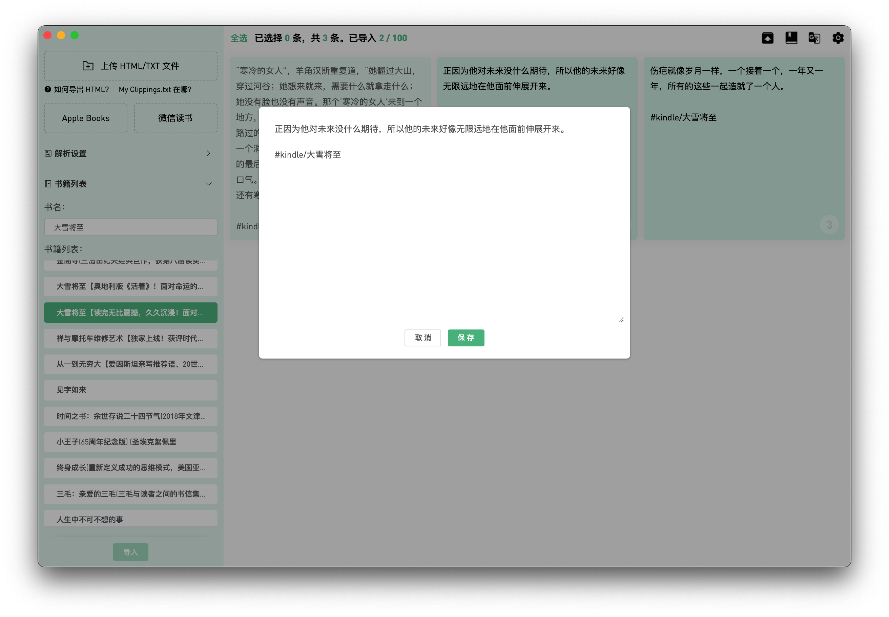
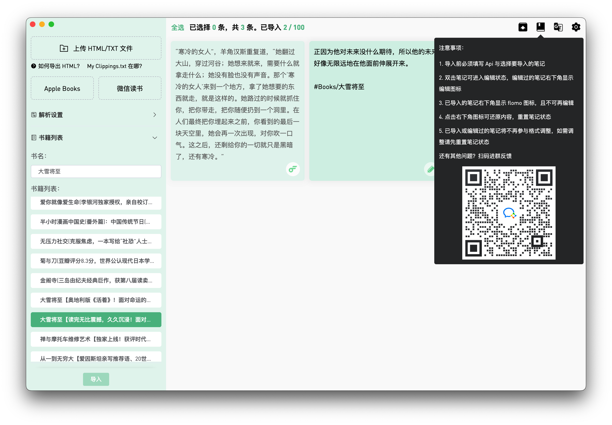

# Send2flomo


&nbsp;&nbsp;&nbsp;&nbsp;
[](https://web.okjike.com/u/FFDB1E46-63DC-43BE-AA1A-36F3D9CD0017)

### 将 Kindle、Apple Books、微信阅读笔记一键导入至 flomo

[中文](./README.md) | [English](./README_en_US.md)

## 预览




## 注册
### [flomo](https://flomoapp.com/register2/?MTAzNDE)

## 网页版（仅支持 html 与 txt 格式导入）
### [Send2Flomo](https://tit1e.github.io/kindle2Flomo/)

## Mac 应用下载
### [网盘下载](https://wwr.lanzoui.com/b02c3nkyf) 访问密码：47if
### [Github Releases](https://github.com/Tit1e/kindle2Flomo/releases)

## 问题反馈


## 开发注意事项
**bplistParser** 这个依赖需手动修改 `maxObjectSize` 与 `maxObjectCount` 这两个常量的数值，修改得大一些，否则当 `Books.plist` 中图书数量过多时会出现无法解析的问题。
```js
exports.maxObjectSize = 1000 * 1000 * 1000;
exports.maxObjectCount = 32768 * 2;
```